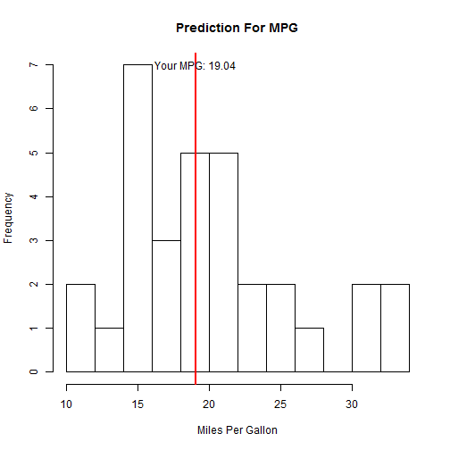

## The Idea 

We have built a model in regression class to predict the MPG(miles per gallon) for automobiles based on the dataset we get from `mtcars`. We can put it as a web application ,users can input their automobile's transimission type, weight and 1/4 mile time then they can get an estimation of the MPG for their car.

The model used was:

$$ mpg=9.6178+2.9358(am=manual)-3.9165wt+1.2259qsec $$


---

## UI Code

First we need to take input from users:


```r
shinyUI(pageWithSidebar(
  headerPanel("Miles Per Gallon Estimation"),
    sidebarPanel(  
    selectInput('am','Transimisson Type',c('Auto','Manual')),
    numericInput("wt", "Weight of your car(ton)", 2),
    numericInput("qsec", "1/4 miles time", 16)
    
  )  
))
```

---

## Server Code

Next step we need to get the data from user input and do the prediction with a linear model.


```r
shinyServer(function(input, output) {
  output$plot <- renderPlot(function() {  
    am=input$am
    if(am=='Auto')
      am=0
    else
      am=1
    qsec=input$qsec
    wt=input$wt
    data(mtcars)
    fit=lm(mpg~am+wt+qsec,data=mtcars)
    newdata=data.frame(am=am,wt=wt,qsec=qsec)
    miles=predict(fit,newdata=newdata)
    hist(mtcars$mpg,breaks=10,xlab="Miles Per Gallon",ylab="Frequency",
         main="Prediction For MPG")
    abline(v=miles,col="red",lwd=2)
    miles.txt=as.character(miles)
    miles.txt=paste("Your MPG:",substr(miles.txt,1,5))
    text(miles,7,miles.txt)
  }, height=500)  
})
```

---

## The Result

Let's say, if we get a input for auto transimission, weight as 2.6,qsec as 16, the results from our application would be like:


 


